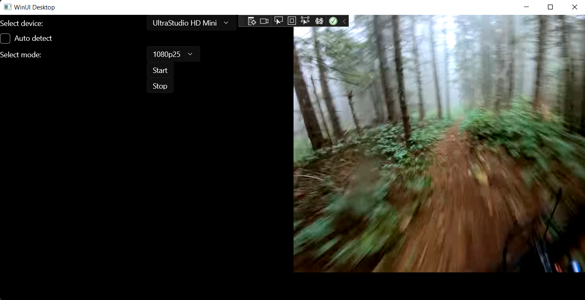

Example project for capture and preview with BlackMagic Design card with WinUI3. I used this to learn DeckLinkSDK and DirectX basics. Now I am working on full product and I decided to share this example.

# Requirements
- .NET 6
- BlackMagic Design SDK

# Usage
Select correct mode and device and hit start.

# Issues
- memory leaks
- stop not working
- not checking input validity
- not rendering full size of video
- many more including code issues
- resizing

To compile project, you might need BlackMagic SDK / Library. You can get it from [here](https://www.blackmagicdesign.com/developer/product/capture-and-playback). Easiest way to obtain DeckLinkAPI is to install Desktop Video. I used version 12.3.

# Caution
This project is just SHOWCASE and has many issues. If you would like to try this project I encourage you to learn something about DirectX 11 rendering and how you should handle COM pointers. Otherwise you can run into big problems with memory leaks etc. So it is wise to understand every line of code before using on production environment.

# Credits
Big thanks to:
[DirectN](https://github.com/smourier/DirectN)
[KlearTouch.MediaPlayer](https://github.com/KlearTouch/KlearTouch.MediaPlayer)
[C++ DirectX 11 Engine Tutorials by Jpres](https://www.youtube.com/playlist?list=PLcacUGyBsOIBlGyQQWzp6D1Xn6ZENx9Y2)

# Contribution
Feel free to create pull requests and issues. I welcome any kind of contribution.